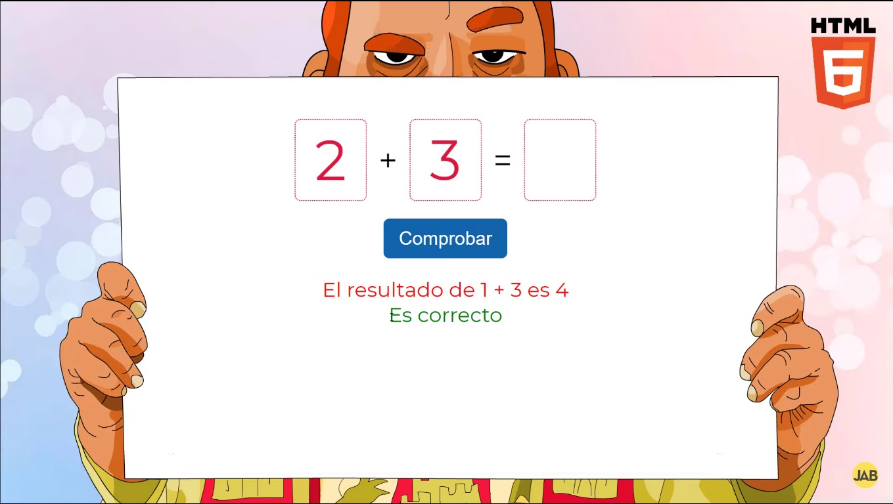

# Ejercicios Javascript


## Tabla de contenido

- [Descripción](#descripcion)
  - [Screenshot](#screenshot)
  - [Links](#links)
- [Mi proceso](#mi-proceso)
  - [Que aprendi](#que-aprendi)
  - [Recursos](#recursos)
- [Autor](#autor)

## Descripción

La idea de este proyecto, es a raíz de mi portfolio. Después de ver varios proyectos y de buscar, se me ocurrió que podía hacerlo a modo de YouTube. Hacer un copycat de la página, con funcionalidades parecidas pero grabando videos con las diferentes prácticas y los enlaces, que vayan a los videos de mi canal. Todos los links de videotutoriales, los voy a ir adjuntando al igual que "pedacitos" de código. La pagina va a estar alojada en gitpages y va a constar de una pagina principal, con los enlaces a los diferentes ejercicios.

### Screenshot




### Links

- Solucion Comprobar_resultado: [YouTube](https://www.youtube.com/watch?v=WQAsMdCkS94&t=292s)


## Mi proceso


### Que aprendi

Un numero random hasta 10
```js

const numeroRandom= max => { return  Math.floor(Math.random() * (max + 1));} 

```

Un numero random entre 2 numeros
```js

const numeroRandomEntreDos= (min, max) => { return  Math.floor(Math.random() *(max - min) + min);}

```

### Recursos

- [Dorian Desings](https://www.youtube.com/@DorianDesings) - DorianDesings
- [Eduardo Fierro](https://www.youtube.com/@EduardoFierroPro) - EduardoFierroPro
- [Jon Mircha](https://www.youtube.com/@jonmircha) - jonmircha 
- [JAB](https://www.youtube.com/@soyjab) - JAB 
- [Carlos Azaustre](https://www.youtube.com/@CarlosAzaustre) - CarlosAzaustre 
- [appAcademy](https://my.appacademy.io/) - appAcademy 


## Autor

- Github - [@AlejandroLaLoggia](https://github.com/AlejandroLaLoggia)
- Frontend Mentor - [@AlejandroLaLoggia](https://www.frontendmentor.io/profile/AlejandroLaLoggia)
- Youtube - [@AlejandroLaLoggia](https://www.youtube.com/@Alejandrolaloggia)
